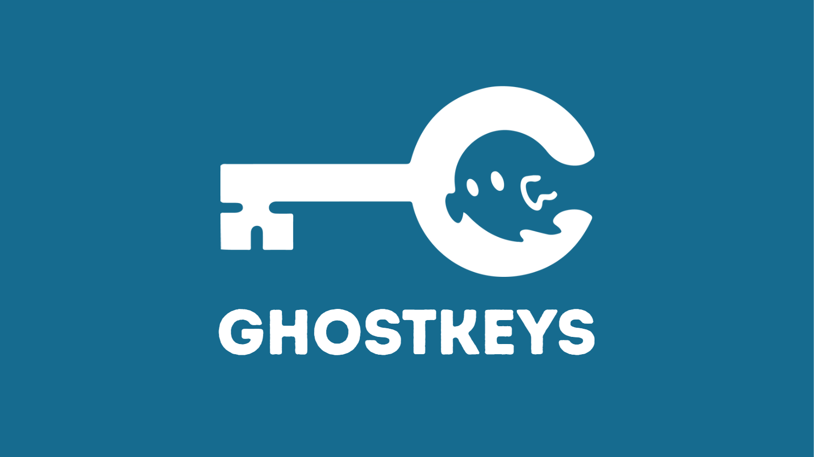

  

<h1 align="center">GhostKeys</h1>

  Decentralized. Client-encrypted. Effortless.  
  A new generation of local-first secret management, built on the <a href="https://internetcomputer.org" target="_blank">Internet Computer Protocol (ICP)</a>.

---

# About GhostKeys

GhostKeys envisions a future where humans **and** machines can store, share, and use secrets without logins, without centralized servers, and without plaintext ever leaving their device.  
By leveraging **decentralized storage** and **local-first design**, GhostKeys replaces bloated, centralized secret managers with a **lightweight, offline-capable alternative** that scales from individuals to enterprises.

### Why GhostKeys?

- 🔐 **Zero-Knowledge** — all encryption happens client-side; canisters never see plaintext.
- 🌐 **Decentralized by default** — built on ICP for resilience, verifiability, and scale.
- 📶 **Offline-first** — fully functional even with no network; sync later if desired.
- 🏢 **Scales with you** — free users share a multi-tenant canister; enterprises get isolated, dedicated vaults.
- 🤖 **Agent-friendly** — designed for AI/automation to read/write without access to raw keys.

---

# Architecture

GhostKeys is composed of **three repos** under the [GhostKeys-App organization](https://github.com/Ghostkeys-App):

### 🔧 Factory Canister
* **Entry point** to the system — the frontend always talks to Factory first.
* **Lifecycle manager** — spawns new Vault canisters for premium users; provides access to shared Vaults for free users.
* **Upgrade-friendly** — Vault binaries fetched dynamically from GitHub Releases, not baked in.
* **Gateway** — exposes consistent APIs to discover and access vault instances.

Repo: [factory-canister](https://github.com/Ghostkeys-App/factory-canister)

---

### 📦 Vault Canister
* Stores **only ciphertext + minimal metadata**:
    - Website Logins (sites → entries)
    - Secure Notes (title → ciphertext body)
    - Flexible Grid (spreadsheet semantics with secret/plain columns)
* Uses **ic-stable-structures** for upgrade-safe storage.
* Supports **vetKD** (Verifiable Encryption to Derived Keys) flows.
* Upgrade-friendly with stable memory.

Repo: [vault-canister](https://github.com/Ghostkeys-App/vault-canister)

---

### 💻 GhostKeys App (Frontend)
* **React + TypeScript** UI.
* **Offline-first** — IndexedDB persistence with optional ICP sync.
* **Factory-first bootstrap** — retrieves canister IDs dynamically, then instantiates actors.
* UX modules:
    - Website Logins
    - Secure Notes
    - Spreadsheet
    - Profile & Seed flows

Repo: [ghostkeys-app](https://github.com/Ghostkeys-App/ghostkeys-app)

---

# Cryptography & Security

GhostKeys uses **modern, verifiable cryptography**, fully client-side:

1. **Account Identity**
    - BIP-39 → SLIP-0010 → Ed25519 → ICP Principal
    - Deterministic from a 12-word mnemonic; nothing stored or transmitted.

2. **VaultKey Derivation**
    - Stable per-user key via SLIP-0010 + SHA-256 hashing.

3. **vetKD Integration**
    - On-chain assisted, scoped derivations.
    - Supports per-user, per-purpose, and rotation contexts.

4. **Final Key**
    - HKDF mix of VaultKey + VetKey → AES-256-GCM.

5. **Encryption/Decryption**
    - AES-256-GCM, random nonces, optional AAD.
    - Only ciphertext + metadata leave the client.

**Invariants**:
- No plaintext ever leaves the client.
- Canisters only store ciphertext + public params.
- Keys are never logged or persisted in plaintext.
- Recovery always possible from mnemonic alone.

---

# Product Vision

GhostKeys is **more than a password manager**:

- **For Individuals** — fast, offline-first, simple vault to replace clunky centralized tools.
- **For Teams & Enterprises** — scalable, decentralized secret management with canister-per-org isolation.
- **For AI & Automation** — a universal, agent-friendly vault that machines can safely access without exposing raw secrets.

---

# Popular Use Cases

- Store and sync **website logins** across devices, with zero plaintext ever leaving the client.
- Maintain **secure notes** and sensitive data, locally or synced to ICP.
- Manage structured data in a **flexible spreadsheet-like vault**.
- Enable AI agents or programs to access secrets **without direct exposure**.

---

# Repos

- [factory-canister](https://github.com/Ghostkeys-App/factory-canister) – system entry point, canister lifecycle manager
- [vault-canister](https://github.com/Ghostkeys-App/vault-canister) – encrypted data store
- [ghostkeys-app](https://github.com/Ghostkeys-App/ghostkeys-app) – frontend UI/UX
- *(coming soon)* **Shared services repo** for ecosystem tooling

---

# Contribute

We welcome contributions from developers, security researchers, and the open-source community!  
Check out our [issues](https://github.com/Ghostkeys-App) or open a PR.

Security audits and feedback are highly appreciated. Please open a private issue or contact us directly for sensitive reports.

---

# Investors & Partners

GhostKeys is positioned to redefine secret management in the era of decentralized computing.  
If you are an investor, enterprise, or partner interested in early collaboration, reach out to us:  
📧 **kostya.code@gmail.com**

---

# License

GhostKeys is open-source software. See the individual repo LICENSE files for details.
